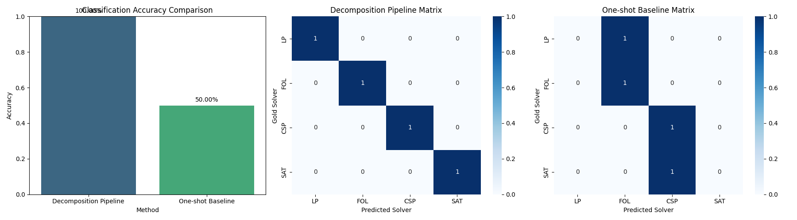

# Solver Select Pipeline

This project implements a neuro-symbolic inference framework capable of dynamically identifying formal reasoning strategies from problems expressed in natural language and classifying the appropriate logic solver. The approach is based on the problem decomposition methodology introduced in [arXiv:2510.06774v1](https://arxiv.org/abs/2510.06774v1).

## Architecture

The pipeline consists of the following core components:

1. **Language Model Client (`llm_client.py`)**: 
   - A wrapper for the Cerebras cloud API using the `gpt-oss-120b` model.
   - It integrates HTTP header monitoring to natively track and adhere to Cerebras token-bucket rate limits (`x-ratelimit-remaining-requests-day` and `x-ratelimit-remaining-tokens-minute`), pausing execution dynamically if limits approach exhaustion.

2. **Logic Pipeline Router (`pipeline_router.py`)**: 
   - Receives natural language reasoning problems and invokes the LLM evaluator using a hyper-specific System Prompt.
   - Governed by an exact temperature (`T=0.01`) and maximum token limit (`max_tokens=4096`), ensuring deterministic and rigorous JSON parsing responses.
   - Outputs the predicted classification of the problem logic.

3. **Problem Decomposition Prompts (`prompts.py`)**: 
   - Houses the original zero-shot categorization prompt designed in the arXiv paper. 
   - The LLM parses text to extract explicit logic features and classify them into one of four solver classes:
     - **LP** (Logic Programming): Rule-chaining and fact progression.
     - **FOL** (First-Order Logic): Expressive reasoning with quantifiers (`forall`, `exists`).
     - **CSP** (Constraint Satisfaction Problems): Finding value assignments within finite domains.
     - **SAT** (Boolean Satisfiability): Validating if a configuration meets logical conditions simultaneously.

4. **Multi-Task Datasets (`dataset_loader.py`)**: 
   - Loads established reasoning datasets representing the four formalisms:
     - **ProofWriter** (`d2qa/proofwriter`) -> **LP**
     - **Yale FOLIO** (`yale-nlp/FOLIO`) -> **FOL**
     - **LogicalDeduction** (`lukaemon/bbh`) -> **CSP**
     - **AR-LSAT** (`tasksource/ar-lsat`) -> **SAT**
   - Features a combined randomized `mixed` loader to robustly test the classification pipeline.

## Usage & Evaluation

An evaluation script `run_eval.py` is provided to measure the classification accuracy of the LLM parser.

**Classification Mode (Pipeline vs One-Shot Baseline Validation):**
```bash
python run_eval.py --eval-classification-only --dataset mixed --limit 10
```
This loads 10 instances per formalism (40 total), randomizes them, and runs each problem through both the Zero-Shot Decomposition Pipeline and a standard One-Shot LLM Prompt. It then outputs a prediction matrix.

*Sample Result Output on 40 problems mixed dataset:*
- **Zero-Shot Decomposition Pipeline Accuracy**: 60.0%
- **One-Shot Baseline Accuracy**: 47.5%



This confirms that explicitly requiring problem decomposition strictly improves LLM semantic classification routing accuracy.

**Full Solver Execution Flow (Translates and Solves logic equations natively):**
```bash
python run_eval.py --dataset folio --limit 10
```

*Note: For full execution flow, you must have the individual solvers (z3, prover9, python-constraint, prolog) natively installed and available in your environment path.*
